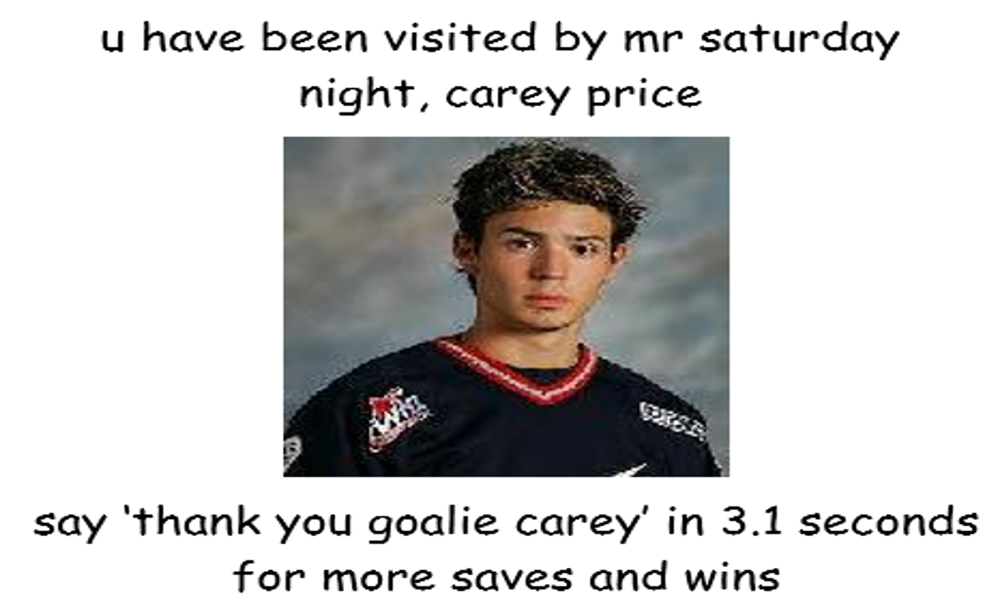

```{r setup, include=FALSE}
knitr::opts_chunk$set(echo = FALSE, fig.align = "center")

library(ggplot2)
library(data.table)
library(lubridate)
library(grid)
library(gridExtra)

source("process_data.R")

games <- readRDS("data_storage/games.rds")
gamesByDay <- readRDS("data_storage/gamesByDay.rds")
meltedGames <- readRDS("data_storage/meltedGames.rds")
gamesBySat <- readRDS("data_storage/gamesBySat.rds")
meltedGames2 <- readRDS("data_storage/meltedGamesBySat.rds")


wloColourScale <- scale_fill_manual(values = c("#F8766D", "#619CFF", "#00BA38"))
```

## Background

Many Montreal Canadiens fans have noticed that the club's starting goaltender Carey Price plays
exceptionally well on Saturday nights. I mean exceptionally well, even compared to his usual
exceptionally-good play. See here an image religiously posted by Canadiens fans after a Saturday
night win:

```{r, out.width = "400px"}

```

I was curious about how big the "Saturday night effect" really is. It's hard to find NHL statistics
broken down by day-of-the-week, so I did a little bit of web scraping and analysis.

I also look the opportunity to give a simple but somewhat accurate explaination of classical statistical
hypothesis testing.

## Basics

Including playoffs, Price has played in `r nrow(games)` total NHL games. He was awarded a decision 
(credited with either a win, loss or overtime loss) in `r games[, sum(GwD)]` of those games. His record is

<center>
  <p style="font-size:20px">`r games[, paste(sum(W), sum(L), sum(OTL), sep = '-')]`</p>
</center>

To begin, let's focus on just the regular season, as the playoffs are a different
beast, where every night is Satuday night. Carey has played in `r games[playoffs == F, .N]`
regular season games, with `r games[playoffs == F & DEC %in% c("W", "L", "OTL"), .N]` decisions, for
a record of 

<center>
  <p style="font-size:20px">`r games[playoffs == F, paste(sum(W), sum(L), sum(OTL), sep = '-')]`</p>
</center>

Without further ado, Carey Price's
regular season record on Saturday nights is

<center>
  <p style="font-size:20px">`r games[playoffs == F & Day == "Sat", paste(sum(W), sum(L), sum(OTL), sep = '-')]`</p>
</center>

for a win percentage of `r round(games[playoffs == F & Day == "Sat", sum(W)/sum(GwD)]*100,1)`%.
Compare this to his season record on all of the other nights:

<center>
  <p style="font-size:20px">`r games[playoffs == F & Day != "Sat", paste(sum(W), sum(L), sum(OTL), sep = '-')]`</p>
</center>

On the other nights of the week, Carey wins `r round(games[playoffs == F & Day != "Sat", sum(W)/sum(GwD)]*100, 1)`%
of his games.

## Pretty pictures

That seems like a pretty big difference. Here it is graphically:

```{r}
ggplot(meltedGames2[playoffs == F], aes(isSat, `%`*100, fill = Result)) +
    geom_bar(stat = "identity", position = "dodge") + 
    ggtitle("goalie carey performance: saturday vs not saturday") +
    scale_x_discrete(limits=c("TRUE", "FALSE"),
                     labels=c("It's Saturday night baby!", "Nope, it's not.")) + 
    xlab("Is it Saturday Night?") + ylab("Win %") +
    geom_text(aes(label = round(`%`*100,1), group = Result), position = position_dodge(0.9), vjust = -0.5) + 
    scale_y_continuous(limits = c(0,70)) +
    wloColourScale
```

Just from those numbers we can't tell the whole story: do other days stand out?
Are Saturdays actually good or is some other day just really bad? Here are Carey's percentage wins,
losses and overtime losses for each day of the week:

```{r}
ggplot(meltedGames[playoffs == F]) +
    geom_bar(mapping = aes(Day, `%`*100, fill = Result), stat = "identity", position = "dodge") +
    wloColourScale +
    xlab(NULL) + ylab("%") +
    ggtitle("Carey Price's Relative Record by Day of the Week")
```

That's pretty impressive! We see that Saturday really is a stand out day, with a 10-point higher win
percentage than any other night. Tuesdays, Thursdays and Saturdays are Price's best nights.
Interestingly, Friday stands out as Carey's worst night: it is the only night with more regulation
losses than wins (Wednesday is exactly even).

There's one problem: by looking at percentages only we may have a skewed idea of what is going
on. While good for direclty comparing days of the week, this view sells short how much Carey
wins overall, because it does not take into account the fact that more games are played on certain
days. So now let's look at the raw *count* of each results on each Day:

```{r}
recordByDay <- gamesByDay[playoffs == FALSE, paste(W, L, OTL, sep = "-"), by = Day]
ggplot(meltedGames[playoffs == F], aes(Day, Count, fill = Result)) +
    geom_bar(stat = "identity", position = "dodge") +
    wloColourScale +
    xlab(NULL) + 
    ggtitle("Carey Price's Record by Day of the Week") + 
    geom_text(data = recordByDay, aes(label = V1, x = Day, y = -5, fill = NULL), size = 3.5)

```

Aha! Price wins the biggest majority of his games on the days when the most games are played.
Furthermore, his weakest day, Friday, is not that big of a game night. In fact, the three
days we picked out as being Carey's best are also the days with the most games. Carey's record is
best on the most popular game nights, making him a winning goaltender over all:

```{r}
ggplot(gamesByDay[playoffs == F], aes(G, `W%`*100)) + geom_label(aes(label=Day)) +
    xlab("Games Played") + ylab("Win %") + 
    ggtitle("Carey Price: Wins Most on the Nights with the Most Games")
```

So far everything we've looked at has been based on the outcomes of entire games. Is it really Carey
that play wells on Saturdays or are the Habs just better in general? Because the two are so linked,
this would be a good question to look into in its own right, by pulling in a bunch of team stats,
looking at games without Price, etc. For now I'm happy to just look at Price's save percentage and
call it a day:

```{r}
careerAverageSVp <- gamesByDay[playoffs == FALSE, sum(SV)/sum(SA)]
ggplot(gamesByDay[playoffs == FALSE], aes(Day, `SV%`)) + geom_point(aes(size = G), col = "#c63939") +
    geom_text(aes(label = round(`SV%`, 3)), nudge_y = 0.002, col = "#c63939") + 
    scale_y_continuous( expand = c(0.5,0)) + 
    scale_x_discrete( expand = c(0.075,0)) + 
    labs(size = "Games") + 
    xlab(NULL) +
    ggtitle("Carey Price: Save Percentage by Day of the Week") + 
    geom_hline(aes(yintercept = careerAverageSVp), linetype = 2, colour = "#c63939", alpha = 0.5) + 
    geom_text(mapping = aes(x = 7.5, y = careerAverageSVp), label = "Career Av.", size = 2.5, nudge_y = 0.002, colour = "#c63939")


```

Indeed, Price's best save percentage is on Saturdays. That doesn't mean his play is solely responsible
for the high proportion of Saturday wins, but it does support the idea that Carey plays at his best
on Saturdays.

## A simple statistical test in detail

*I'm going to go into a lot of detail for those interested understanding the basics of statistical
testings. If you don't care or already know this, the long and short is that Carey really does win
"statistically significantly" more on Saturdays.*

Looking at these plots is nice, and they show that Carey's record is better on Saturdays than the 
other nights of the week. But we wonder whether this is just a fluke. After all, if you flipped
coins every day of the week, some days are going to have more heads than others, just due to chance.
This sort of question is where "statistical significance" comes into play. Stated very simply, the
idea of statistical significance just involves combining the difference in win percentage with
information about sample size. For better or for worse, the standard approach to determining
statistical significance uses "classical" statistical hypothesis testing.

I had one specific question, that I had in my head before I saw any data:

> "Does Carey Price really win more on Saturday Nights?"

To rigorously interpret a statistical test, it's important to know the research question ahead of time
and stick to it. The hypotheses we are testing are:

\begin{equation}
\begin{aligned}
\text{Null Hypothesis }(H_0) & \; \text{: Carey wins the same proportion of games regardless of whether it is Saturday or not} \\
\text{Alt. Hypothesis }(H_1) & \; \text{: Carey wins a higher proportion of games on Saturdays than on other days}
\end{aligned}
\end{equation}

Our test will either present strong enough evidence to reject the null hypothesis, or it won't. The
evidence will come in the form of a *test statistic*, a number that summarizes information about the
relative proportions of wins on each type of night, along with the sample sizes. The classical approach
is pretty much: if this test statistic is big enough, we will reject $H_0$. This means we conclude
that Carey wins more on Saturdays. If the test statistic is not begin enough, we are stuck with our
null hypothesis. We haven't proved that the null hypothesis is true, we've just failed to
find any evidence that the alternative is better.

To start, we a choose statistical model for the data, which involves making some assumptions and simplifications.
My model views each game as a *Bernoulli trial*, from one of two populations (Saturday games and non-
Saturday games). This means that the Saturday games in our dataset are a random sample from a 
hypothetical, infinite population of Saturday games, that all share a common probability of a win, $p_1$.
Similarly the non-Saturday games are a sample from a population with a possibly different chance of
winning, $p_2$. Our hypothesis test can then be stated:

\begin{equation}
\begin{aligned}
H_0: \; & p_1 = p_2 \\
H_1: \; & p_1 > p_2
\end{aligned}
\end{equation}

Now, we form our test statistic $Z$, which depends on the observed proportions of wins, as well as the
number of games worth of data we have:

$$
\frac{p_1 - p_2}{ \sqrt{ p ( 1 - p ) [ (1/n_1) + (1/n_2) ] } }
$$
```{r}
p1 <- gamesByDay[playoffs == F & Day == "Sat", sum(W)/sum(GwD)]
n1 <- gamesByDay[playoffs == F & Day == "Sat", sum(GwD)]

p2 <- gamesByDay[playoffs == F & Day != "Sat", sum(W)/sum(GwD)]
n2 <- gamesByDay[playoffs == F & Day != "Sat", sum(GwD)]

p <- (p1 * n1 + p2 * n2) / (n1 + n2)
SE <- sqrt( p*(1-p) * (1/n1 + 1/n2))
z <- (abs(p1 - p2))/SE
p <- 1 - pnorm(z)
roundZ <- round(z, 3)
```

where $p_1$ is the Saturday win percentage, $p_2$ is the non-Saturday win percentage,
$n_1$ is the number of Saturday games, $n_2$ is the number of non-Saturday games, and $p$ is the
overall win percentage. Why this statistic? See [here](https://onlinecourses.science.psu.edu/stat414/node/268).
Without getting into the math, you can see some basic facts about this statistic:

- the greater $p_1$ is compared to $p_2$, the bigger the statistic
- the larger $n_1$ and $n_2$ are, the bigger the statistic

For our data, $p_1 = `r round(p1,3)`$, $n_1 = `r n1`$, $p_2 = `r round(p2, 3)`$, and $n_2 = `r n2`$. So
$Z \approx `r roundZ`$. As I mentioned, the larger $Z$, the stronger the evidence that Carey wins
more on Saturdays. From the test statistic, we can compute the infamous "$p$-value". The $p$ value is
the probability, if the *null hypothesis were true*, that our test-statistic would come out to be
$`r roundZ`$ or bigger. In plainer speak, the $p$-value is the chance that we would see Carey win at
least this much more on Saturdays, even if the Saturday effect isn't real. Two things
can increase $Z$: seeing a higher difference in win percentage, or observing more games.

For our data, the $p$-value is $`r round(p,6)`$, or almost exactly $0.001$. This means that the chances we saw such a big Z
value given no real improvement on Saturdays is about $1/1000$. At any reasonable confidence level, 
I conclude Mr. Saturday night is statistically legit.

## The Playoffs

As a Habs fan, I hate to say it, but in the playoffs the Mr. Saturday Night effect is not present.
If anything, it's reversed. Remember that the sample size of playoff games is small, so this data
is not as informative. I've run out of steam on this whole thing, so I'm just going to present 
the playoff results without any hard-hitting analysis. All ears to comments on this reversal.

First off, the win percentage plot again:

```{r}
ggplot(meltedGames[playoffs == T & Result != "OTL"]) +
    geom_bar(mapping = aes(Day, `%`*100, fill = Result), stat = "identity", position = "dodge") +
    wloColourScale +
    xlab(NULL) + ylab("%") +
    ggtitle("Carey Price's Relative Record by Day of the Week (Playoffs)")
```

And here is the raw count plot:

```{r}
recordByDay <- gamesByDay[playoffs == TRUE, paste(W, L, sep = "-"), by = Day]
ggplot(meltedGames[playoffs == TRUE & Result != "OTL"], aes(Day, Count, fill = Result)) +
    geom_bar(stat = "identity", position = "dodge") +
    wloColourScale +
    xlab(NULL) + 
    ggtitle("Carey Price's Record by Day of the Week (Playoffs)") + 
    geom_text(data = recordByDay, aes(label = V1, x = Day, y = -0.5, fill = NULL), size = 3.5)

```

Saturdays look rough. Does Carey really play worse on Saturdays in the playoffs though? Let's
look at the SV% plot:

```{r}
careerAverageSVp <- gamesByDay[playoffs == TRUE, sum(SV)/sum(SA)]
ggplot(gamesByDay[playoffs == TRUE], aes(Day, `SV%`)) + geom_point(aes(size = G), col = "#c63939") +
    geom_text(aes(label = round(`SV%`, 3)), nudge_y = 0.002, col = "#c63939") + 
    scale_y_continuous( expand = c(0.5,0)) + 
    scale_x_discrete( expand = c(0.075,0)) + 
    labs(size = "Games") + 
    xlab(NULL) +
    ggtitle("Carey Price: Save Percentage by Day of the Week") + 
    geom_hline(aes(yintercept = careerAverageSVp), linetype = 2, colour = "#c63939", alpha = 0.5) + 
    geom_text(mapping = aes(x = 7.5, y = careerAverageSVp), label = "Career Av.", size = 2.5, nudge_y = 0.002, colour = "#c63939")


```

I hate to even bring this up because Carey price is the closest thing to a god that I believe in, 
but if the Habs are going to win a cup, the Saturday night magic must continue on through to the 
post season.

If you're wondering, including the playoff data in all of the previous analysis doesn't change
anything much.
The number of playoffs games (`r games[playoffs == T, .N]`) is so small compared to regular season
games (`r games[playoffs == F, .N]`) that the effect is minimal.

## Some notes on how this was made

I created this using solely R-based tools, or other tools with interfaces for R. The data was
collected using Selenium, which automates web-browsers to collect information that is generated
by scripts on web-pages. Selenium bindings for R were provided by the `RSelenium` package. The data
was manipulated using the fantastic `data.table` package, and the plots generated with minimal fuss
using the well known `ggplot2` package. All exploration on my end was done using these tools.

This document itself was created using `knitr` and `RMarkdown`, with the code living within the document
itself. The beauty of all of this is that as the stats are updated on the web, the new plots and
analysis can be automatically refreshed. I started this document last week, and today I was able to
easily update it to include Carey's Saturday night win against Ottawa yesterday.

If you've got any thoughts on what could make this more useful, more correct or more entertaining,
let me know. If you have any questions you want me to check out using this data, let me know. Or do 
it yourself. If you have any questions about doing that ask and I'm sure myself and plenty of other
nerds will be glad to help.
